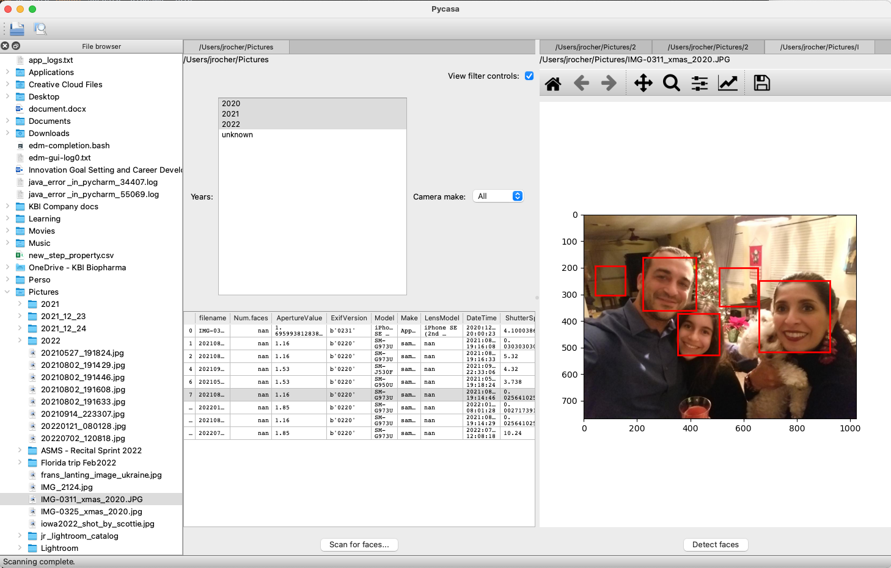

# Sharing your scientific tools: from a script to a desktop application
This repository contains a GUI building and packaging tutorial using the 
[Enthought Tool Suite](https://docs.enthought.com/ets/) accepted for the 
[SciPy2022 conference](https://www.scipy2022.scipy.org/).

## Tutorial summary

In this workshop, we will learn to embed scientific tools into a robust 
scientific application that can scale from a tiny UI to a large platform. As an 
example, attendees will build an image browser application (including 
face-detection capabilities), allowing users to search through their pictures, 
based on various criteria. We will start from a simple python script and 
progressively turn it into a complete application using Matplotlib and several 
packages from the Enthought Tool Suite such as Traits, TraitsUI and Pyface. In 
the process, attendees will learn how to design clean, maintainable and 
scalable applications, and discuss sharing your tool with your users.

Ultimately, we will be building fairly sofisticated application that allows 
users to explore images on their machines and detect faces in them:




## Set up instructions
First step to set yourself up is to clone this repository
```commandline
git clone git@github.com:jonathanrocher/ets_tutorial.git
```

### Requirements

- Python 3.6+
- scikits.image
- Pillow
- Pandas
- matplotlib
- traits
- traitsui

### EDM users (recommended)
First, download and install EDM from https://www.enthought.com/edm/. Then, 
open a `Terminal`/`Powershell`/`Cmd Prompt`/ and create a lighweight bootstrap environment to run the installation commands.
```commandline
edm envs create bootstrap
edm install --environment bootstrap click
```
Next, enter the following commands to create a 
dedicated Python environment called `ets_tutorial` and install all dependencies in it:
```commandline
edm run -e bootstrap -- python ci build --environment ets_tutorial
```
All application related `python` commands are assumed to run in this
environment. You can activate the environment with:
```commandline
edm shell -e ets_tutorial
```

### Conda users
Create a new conda environment called `ets_tutorial` and install local
dependencies with the following commands:
```commandline
conda create -n ets_tutorial python=3.6 pandas matplotlib traits traitsui scikit-image pillow pyqt ipython importlib_resources importlib_metadata
conda activate ets_tutorial
python setup.py install
```
Activate the new environment with `conda activate ets_tutorial`.

### pip users
Assuming a Python environment is created and activated on your machine, for 
example from https://www.python.org/, 
```commandline
pip install pandas matplotlib traits traitsui scikits-image pillow pyqt5 ipython
python setup.py install
```

## Getting help
### During the tutorial
During the tutorial, don't hesitate to ask for help: 
- ask questions if something isn't clear,
- or just call out for individual support: there will be a number of developers 
  in the room who can help unblock you.

### After the tutorial
- This tutorial was recorded and can be watched [here]() [TODO]
- You can ask questions about any of the ETS packages on the ETS mailing list:
  https://groups.google.com/g/ets-users .
- Each of the other packages has its own dedicated mailing list where questions 
  can be posted.


## Outline of the tutorial
The tutorial will guide you through all the stages from a basic python script 
(stage 1) to a fully packaged and installable application (stage 8). The 
included exercises will walk you through developing the primary product of 
each stage.
A solution is available for each exercise, though, to ensure all participants 
are able to reach the end goal.

  - step 1: python script
  - step 2: more robust script with ETS-Traits
  - step 3: GUI: first traitsUI views
  - step 4: pyface application: tree navigator and double-click on an image to 
    display the traitsUI view of the image.
  - INTERLUDE: code structure for scalability
  - step 5: Fuller pyface application: 
    - add folder editor to display a table of metadata for all images inside
    - add button to launch the face detection on all images
    - add widgets to filter images
  - step 6: pyface application: adding menu and branding 
  - step 7: pyface application: advanced features [OPTIONAL]
  - step 8: 1-click installer


## Contributing
### Code structure
[TODO]

### Rules for contributing to the repository
Contributing to this repository requires:
1. to make a Pull Request
2. all code contributed must be pep8 compliant
3. all unit tests must pass
